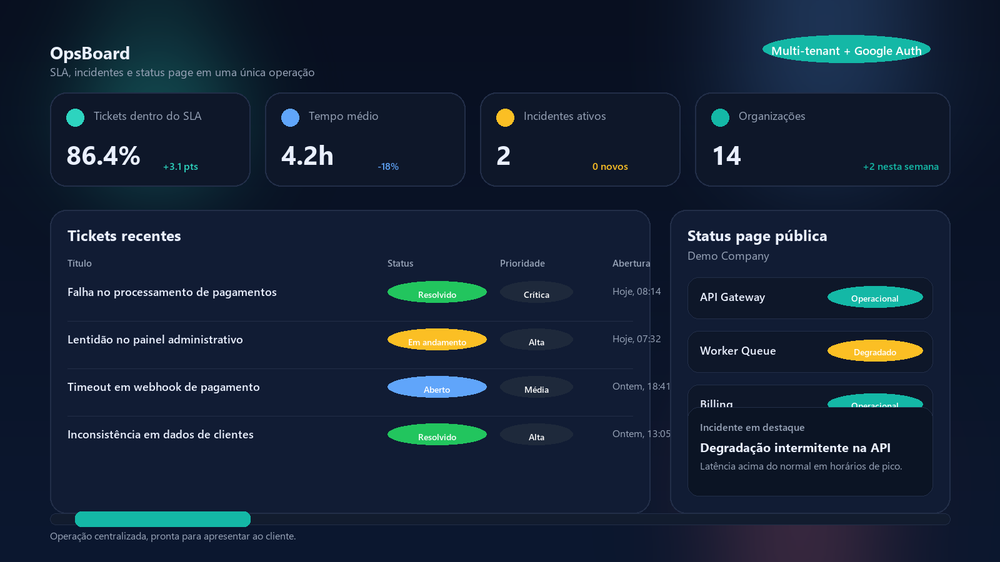
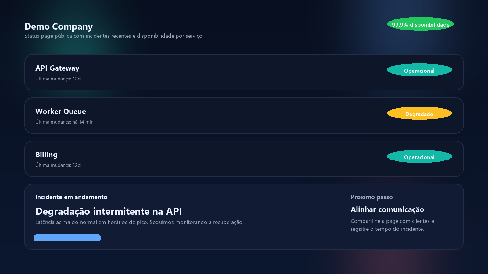
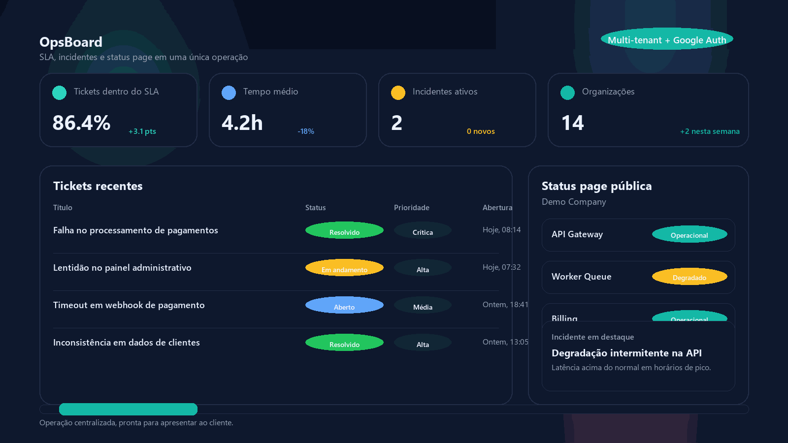

# OpsBoard

OpsBoard é uma plataforma B2B para centralizar suporte, SLA, incidentes e status page pública em um único fluxo. A proposta é simples: transformar operação dispersa em visibilidade, comunicação e rastreabilidade para o time interno e para o cliente.

## Por que isso importa

- Menos troca de contexto entre suporte, produto e operações.
- Uma visão única de tickets, incidentes e saúde dos serviços.
- Status page pública por empresa, pronta para comunicar o cliente sem planilhas ou ferramentas extras.
- Arquitetura multi-tenant com isolamento por organização.

## Produto em ação

<table>
  <tr>
    <td></td>
    <td></td>
  </tr>
  <tr>
    <td colspan="2"></td>
  </tr>
</table>

## O que o produto entrega

- Autenticação com JWT em cookie HTTP-only.
- Cadastro que cria organização, usuário e serviços padrão em um único passo.
- Gestão de tickets com SLA, prioridade, abertura e resolução.
- Gestão de incidentes com impacto automático nos serviços.
- Status page pública por empresa em `/status/:slug`.
- Suporte a Google Auth via Firebase.
- Seed demo para apresentar o produto sem montar dados do zero.

## Fluxo ponta a ponta

1. O usuário se registra e já entra em uma organização isolada.
2. O dashboard mostra tickets, SLA e métricas operacionais.
3. O time cria tickets e incidentes no mesmo ambiente.
4. Quando um incidente afeta um serviço, o status do serviço é refletido na status page pública.
5. O cliente acessa a página pública da organização e acompanha a situação em tempo real.

## Stack

- Next.js 16.0.10 com App Router e API Routes.
- React 19.
- TypeScript.
- PostgreSQL.
- Prisma ORM.
- TailwindCSS.
- Firebase Auth e Firebase Admin para login com Google.

## Segurança e isolamento

- Cookie de sessão com `httpOnly`, `sameSite=lax` e `secure` em produção.
- Validação de payload nas rotas mutadoras.
- Verificação de pertencimento do `serviceId` à mesma organização antes de atualizar incidentes.
- Verificação do token do Google no backend antes de criar sessão.
- Isolamento por `organizationId` em tickets, incidentes, serviços e usuários.

## Estrutura do projeto

```bash
.
├── app/
│   ├── api/                # Auth, tickets, incidentes, SLA, Firebase config
│   ├── dashboard/          # Dashboard interno
│   ├── incidents/          # Gestão de incidentes
│   ├── login/              # Login
│   ├── register/           # Cadastro
│   └── status/[slug]/      # Status page pública
├── components/             # Interface e formulários
├── lib/                    # Auth, Prisma, Firebase e cálculo de SLA
├── prisma/                 # Schema, migrations e seed
├── public/readme/          # Screenshots e GIF do produto
└── render.yaml             # Deploy no Render
```

## Como rodar localmente

### 1) Pré-requisitos

- Node.js 20+
- PostgreSQL

### 2) Variáveis de ambiente

Crie um arquivo `.env` com pelo menos:

- `DATABASE_URL`
- `JWT_SECRET`
- `PORT`

Se for usar login com Google, configure também as variáveis `NEXT_PUBLIC_FIREBASE_*` e `FIREBASE_*` descritas abaixo.

### 3) Instalar dependências

```bash
npm install
```

### 4) Aplicar migrations

```bash
npx prisma migrate deploy
```

### 5) Carregar dados demo

```bash
npm run prisma:seed
```

### 6) Subir a aplicação

```bash
npm run dev
```

Depois, acesse `http://localhost:3000`.

## Conta demo

- E-mail: `admin@demo.com`
- Senha: `demo1234`

Essa conta é criada pelo seed e já vem com dados para demonstrar tickets, SLA e incidentes.

## Google Auth

O login social usa Firebase Auth no cliente e Firebase Admin no backend.

### Variáveis do frontend

- `NEXT_PUBLIC_FIREBASE_API_KEY`
- `NEXT_PUBLIC_FIREBASE_AUTH_DOMAIN`
- `NEXT_PUBLIC_FIREBASE_PROJECT_ID`
- `NEXT_PUBLIC_FIREBASE_STORAGE_BUCKET`
- `NEXT_PUBLIC_FIREBASE_MESSAGING_SENDER_ID`
- `NEXT_PUBLIC_FIREBASE_APP_ID`
- `NEXT_PUBLIC_FIREBASE_MEASUREMENT_ID`

### Variáveis do backend

- `FIREBASE_PROJECT_ID`
- `FIREBASE_CLIENT_EMAIL`
- `FIREBASE_PRIVATE_KEY`

Se as variáveis públicas não estiverem configuradas, o botão de Google Auth fica desativado sem quebrar o deploy.

## Deploy no Render

O projeto já inclui `render.yaml`.

1. Faça push do repositório no GitHub.
2. No Render, crie um novo Blueprint.
3. Conecte o repositório.
4. Configure `DATABASE_URL` e `JWT_SECRET`.
5. Faça o deploy.

O script de start executa a migration antes de iniciar o Next.js.

## Troubleshooting do Render

Se aparecer `Environment variable not found: DATABASE_URL`, confirme:

1. O banco PostgreSQL foi criado na mesma região do serviço web.
2. A `Internal Database URL` foi copiada para o serviço certo.
3. O serviço web recebeu `DATABASE_URL` e `JWT_SECRET`.
4. Você rodou um novo deploy após salvar as variáveis.

Se quiser validar a aplicação depois do deploy:

1. Abra `/register` e crie uma conta.
2. Faça login em `/login`.
3. Verifique `/dashboard` e `/status/:slug`.

## Seed e demo

O seed cria:

- Uma empresa demo com múltiplos serviços, incidentes e histórico de tickets.
- Contas demo para testar o produto sem precisar criar usuários do zero.
- Tickets em aberto, em andamento, resolvidos e fechados, com SLA variado.
- Incidentes ativos e resolvidos para deixar a status page pública mais realista.

Contas demo prontas:

- `admin@demo.com` / `demo1234`
- `suporte@demo.com` / `demo1234`
- `ops@demo.com` / `demo1234`

Empresa demo:

- Slug: `demo-company`

## Próximos passos naturais

1. Conectar métricas do dashboard com um pipeline real de incidentes.
2. Adicionar notificações por e-mail ou Slack.
3. Criar páginas de marketing e pricing para transformar o produto em uma oferta comercial completa.